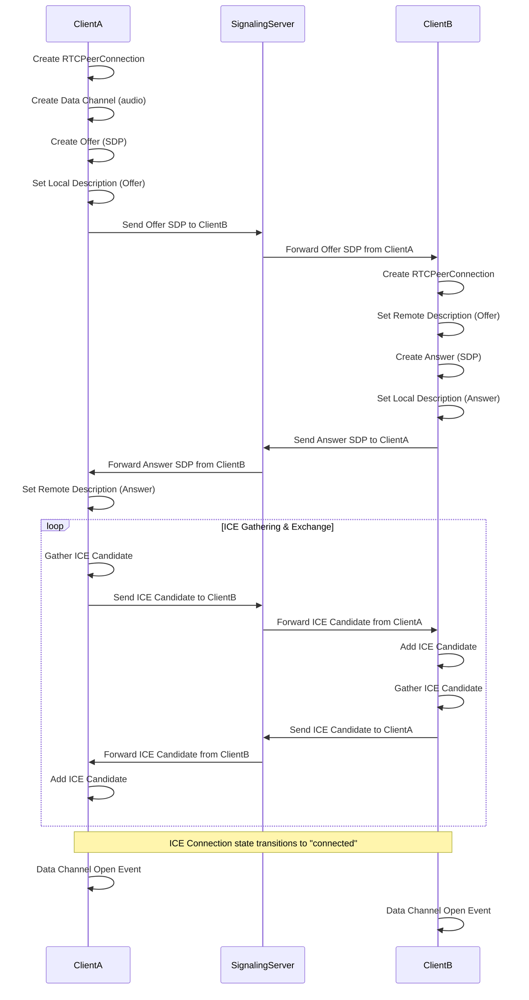

```mermaid
sequenceDiagram
    participant ClientA
    participant SignalingServer
    participant ClientB

    ClientA->>ClientA: Create RTCPeerConnection
    ClientA->>ClientA: Create Data Channel (audio)
    ClientA->>ClientA: Create Offer (SDP)
    ClientA->>ClientA: Set Local Description (Offer)
    ClientA->>SignalingServer: Send Offer SDP to ClientB

    SignalingServer->>ClientB: Forward Offer SDP from ClientA

    ClientB->>ClientB: Create RTCPeerConnection
    ClientB->>ClientB: Set Remote Description (Offer)
    ClientB->>ClientB: Create Answer (SDP)
    ClientB->>ClientB: Set Local Description (Answer)
    ClientB->>SignalingServer: Send Answer SDP to ClientA

    SignalingServer->>ClientA: Forward Answer SDP from ClientB

    ClientA->>ClientA: Set Remote Description (Answer)

    loop ICE Gathering & Exchange
        ClientA->>ClientA: Gather ICE Candidate
        ClientA->>SignalingServer: Send ICE Candidate to ClientB
        SignalingServer->>ClientB: Forward ICE Candidate from ClientA
        ClientB->>ClientB: Add ICE Candidate

        ClientB->>ClientB: Gather ICE Candidate
        ClientB->>SignalingServer: Send ICE Candidate to ClientA
        SignalingServer->>ClientA: Forward ICE Candidate from ClientB
        ClientA->>ClientA: Add ICE Candidate
    end

    Note over ClientA,ClientB: ICE Connection state transitions to "connected"

    ClientA->>ClientA: Data Channel Open Event
    ClientB->>ClientB: Data Channel Open Event

```